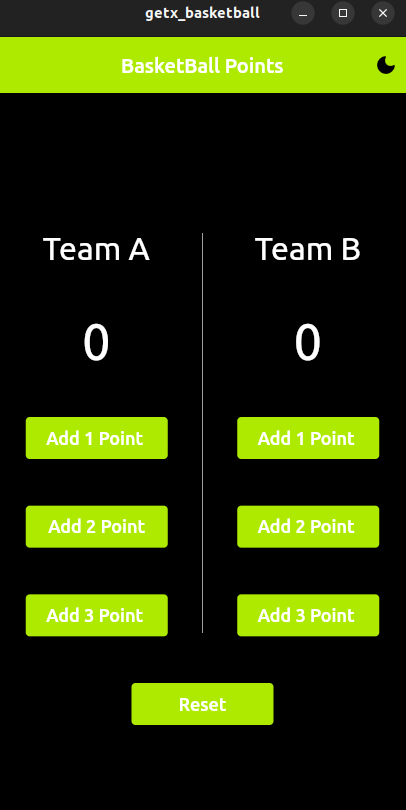
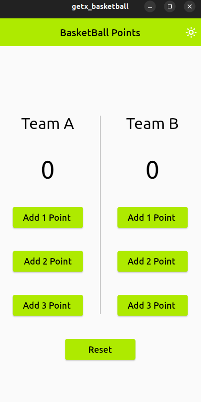

# getx_basketball

## Future app
 - State managemenet using *getx* 
 - Dark && light Theme using SharedPreference 

|Dark Mode | Light Mode |
|----------|------------------------|
|<code> | <code>|  
